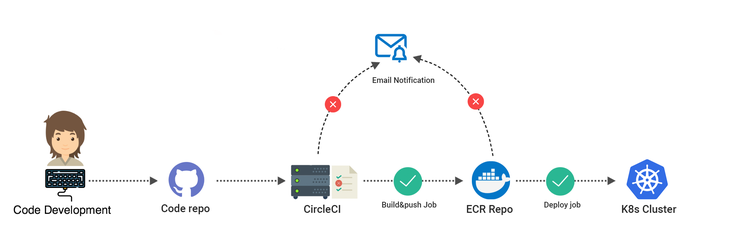
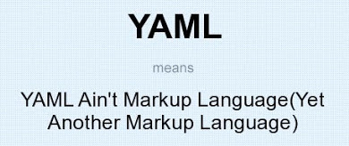
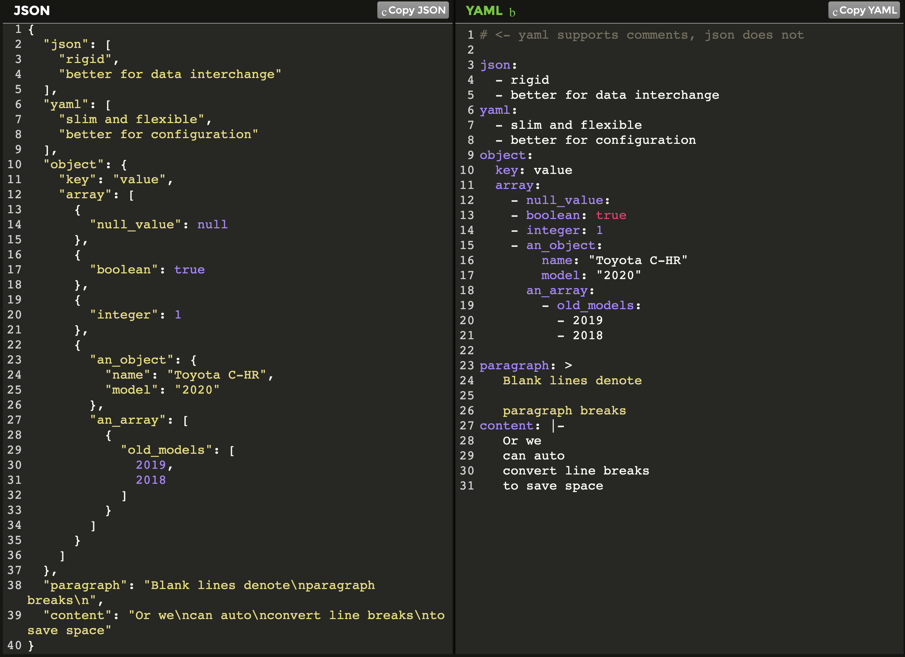

### What is CI/CD?
CI/CD or CICD generally refers to the combined practices of continuous integration and either continuous delivery or continuous deployment
- `Continuous Integration (CI)` is the practice of automating the integration of code changes from multiple contributors and check the new code’s correctness by automated code quality tests like smoke, unit, integration.
- `Continuous Delivery (CD)` is the software development process of getting code changes into production quickly and safely.


### What is CircleCI?
CircleCI is a fully managed continuous integration and delivery platform which allows us to build, test or deploy our code on every check in.


CircleCI uses a YAML configuration file to declare the pipeline and it lives under the project root `.circleci` folder with name `config.yml` (Default convention)

#### YAML in short:

Let get familier with some basic syntax that will frequently use for the configuration. 
Here we will compare with JSON so that we can easily understand which syntax is using for what.


### Getting Started
So, let's configure a pipeline for a mini project. We will start from minimal configuration.
- First of all, login to circleci with github
- Setup project
- Create a directory `.circleci`  to your project root and a `config.yml` under it with a minimal content of
```yml
version: 2.1
jobs:
  build:
    docker:
      - image: circleci/node:8.10
    steps:
      - checkout
      - run: echo "A first hello"
```
Let's explain a bit very shortly what's in the `config.yml` we will explan more later.

- `version`: Specifying which circleci config version we are using.
- `jobs`: All job will be defined under the jobs block
    - `build`: is the name of our job
        - `docker`: This is kind of a executor (Where the job steps will run)
            - `- image`: Specifying our docker image (it can be multiple)
        - `steps`: is the set of commands that will run step by step based on our defination.
            - `checkout`: Is actually pulling your code from github
            - `run`: Here we will write our commands. you can imagine like running command in terminal.

Let's push our code and see what happens on circleci.
<Image HERE>
So we can see a job called build i